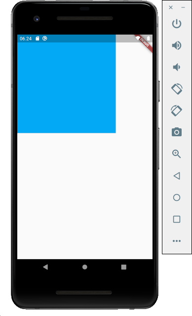

# Cotainer Widget
Apa itu container widget? Container widget adalah Komponen petama yang membungkus banyak komponen kecil lainnya seperti button, textfield dan lain-lain dengan padding (yang meningkatkan keindahan tampilan dari sisi ke sisi lainnya) dan kemudian berlaku hambatan tambahan ke batas empuk (menggabungkan lembar serta tinggi sebuah bambatan, jika baik sedang non-null). Wadah sedang mengurung oleh tambahan ruang kosong dijelaskan dari margin. Container ini kalau di android hampir sama dengan fungsi <b>frame layout</b>   
Dibawah ini adalah contoh penggunaan container widget pada flutter   
<b>main.dart</b>   
Pada class main.dart tambahkan code seperti dibawah ini:
<pre>
import 'package:flutter/material.dart';
void main() {
  runApp(container());
}
class container extends StatelessWidget {
  @override
  Widget build(BuildContext context) {
    return MaterialApp(
      home: Scaffold(
        body: Container(
          color: Colors.black,
          child: Text("My Container"),
          height: 300.0,
          width: 300.0,
          alignment: Alignment.center,
          padding: EdgeInsets.all(20.0),
          foregroundDecoration: BoxDecoration(
            color: Colors.lightBlue,
          ),
        ),
      ),
    );
  }
}
</pre>
  

  
Ketika kita jalankan aplikasi, maka akan tampak seperti diatas. Kita dapat melihat container memiliki warna biru terang dengan tinggi (heigt) 300px dan lebah (width) 300px. Syntax yang di gunakan untuk tampilan container seperti diatas terletak pada bagian dibawah ini:
<pre>
body: Container(
          color: Colors.black,
          child: Text("My Container"),
          height: 300.0,
          width: 300.0,
          alignment: Alignment.center,
          padding: EdgeInsets.all(20.0),
          foregroundDecoration: BoxDecoration(
            color: Colors.lightBlue,
          ),
        ),
</pre>